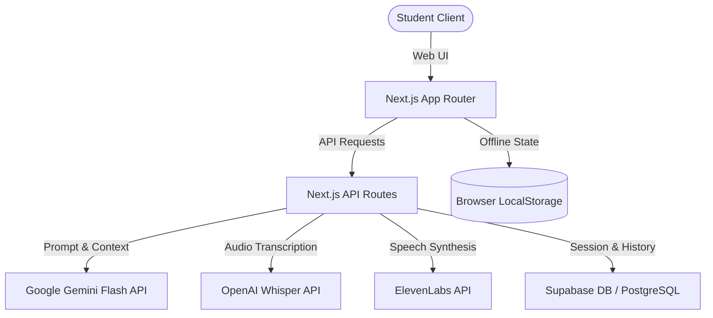

# 🧠 VidyaBot: AI Regional Tutor Built for Bharat 🇮🇳

VidyaBot is a patient, encouraging, and multilingual AI tutor designed to make academic doubt-solving accessible, engaging, and personalized for school students across India. By utilizing advanced AI technologies, VidyaBot breaks down language and accessibility barriers in education.

---

## 📌 Problem Statement
Many school students in regional areas across India face substantial barriers in academic doubt-solving:
* **Language Barriers**: Most educational platforms and AI tools default to English or use awkward machine translations, overlooking regional dialects and Hinglish conversations.
* **Lack of Multi-Modal Interaction**: Typing out long questions (especially in regional scripts) is tedious; students need to snap photos of their textbooks or ask questions via voice.
* **No Long-Term Retention**: Sessions are often ephemeral, resulting in lost study history and streaks when the browser is closed or when logging in from multiple profiles.
* **Parental Disconnect**: Parents in regional environments often lack clear, simple, and automated insights into their children's learning achievements and areas of difficulty.

---

## ✨ Features

### 🇮🇳 Regional Multi-Language Learning
Select preferences and interact in **Hindi 🇮🇳, English 🇬🇧, Tamil 🇮🇳, Telugu 🇮🇳, Bengali 🇮🇳, Marathi 🇮🇳, and Kannada 🇮🇳**. System prompts ensure natural, conversational regional language responses.

### 📸 OCR Textbook Scan (Photo Doubt Solver)
Snap a photo or upload an image of any textbook question. VidyaBot performs advanced OCR via Gemini Flash, extracts the question, categorizes it, and explains it step-by-step.

### 🎤 Voice Doubt Solver & Text-To-Speech
Record voice queries. The system transcribes voice inputs using OpenAI Whisper, processes the query, and converts responses to speech via ElevenLabs Multilingual TTS.

### 🎯 Gamified Progress Systems (XP & Streaks)
Students earn XP based on engagement (Text = +10 XP, Photo = +15 XP, Voice = +20 XP, Re-explain = +5 XP). Daily logins and doubt submissions update study streaks. All metrics are safely persisted in Supabase via database RPC triggers.

### 🔑 Secure OTP-Style PIN & Multi-Profile Selector
Protects student histories using a secure 4-digit PIN. Resolves overlapping names (e.g. "Rohan") by presenting a profile selector during authentication.

### 🎯 Interactive Quick Quiz Arena
Generates instant multi-choice questions based on the student's actual study history to reinforce concepts, complete with visual explanations and bonus XP.

### 📋 AI Parent Progress Reports
Generates automated, professional progress paragraphs for parents in their preferred language, tracking total doubts asked, weakest subject areas, and next-week recommendations.

---

## 🛠️ Tech Stack
* **Framework**: Next.js (App Router, Tailwind CSS, TypeScript)
* **AI & Language Processing**: Google Gemini API (`gemini-flash-latest`)
* **Audio Processing**: OpenAI Whisper-1 (Speech-to-Text) & ElevenLabs API (Text-to-Speech)
* **Database & Auth**: Supabase (PostgreSQL with custom functions/RPCs)
* **Icons & UI Utilities**: Lucide React, Tailwind CSS Shimmer effect
* **Hosting**: Vercel-ready config

---

## 📐 System Architecture



---

## ⚙️ Environment Variables
Create a `.env.local` file in the root directory (based on `.env.example`) and add your keys:

```bash
# Google Gemini Key (Required)
GEMINI_API_KEY=your_gemini_api_key_here

# OpenAI API Key (Required for Voice-to-Text Whisper)
OPENAI_API_KEY=your_openai_api_key_here

# ElevenLabs API Key (Optional, for Voice Text-to-Speech)
ELEVENLABS_API_KEY=your_elevenlabs_api_key_here

# Supabase Configurations (Required)
NEXT_PUBLIC_SUPABASE_URL=https://your-project.supabase.co
NEXT_PUBLIC_SUPABASE_ANON_KEY=your-anon-key-here
SUPABASE_SERVICE_ROLE_KEY=your-service-role-key-here
```

---

## 🚀 Installation & Local Development

### 1. Clone the repository
```bash
git clone <your-repository-url>
cd vidyabot
```

### 2. Install dependencies
```bash
npm install
```

### 3. Setup Database Schema
Execute the queries in `schema.sql` inside your Supabase SQL Editor. This will configure the `users`, `doubts`, and `sessions` tables, plus the `increment_xp` and `update_streak` RPC functions.

### 4. Run database seed (Optional)
Starts a dev server and populates mock data:
```bash
npm run dev
# In another terminal:
npm run seed
```

### 5. Start Development Server
```bash
npm run dev
```
Open **[http://localhost:3000](http://localhost:3000)** to view the app.

---

## 📦 Deployment to Vercel
1. Push your code to GitHub.
2. Import the repository into your Vercel Dashboard.
3. Configure the Environment Variables in the project settings.
4. Click **Deploy**. Vercel will build and host the application automatically.

---

## 🗺️ Future Roadmap
- **Interactive Concept Maps**: Visualizing academic concepts in interactive diagrams.
- **Peer Study Groups**: Allowing students of the same grade to study and solve quizzes together.
- **Offline Sync PWA**: Fully functional service worker cache for low-connectivity rural schools.
- **Syllabus Board Alignment**: Tailoring explanations specifically to CBSE, ICSE, or State Board curriculums.
